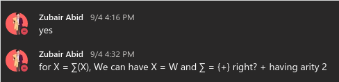
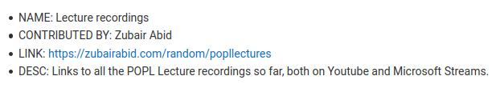

## In-class contributions

I have been sufficiently active in class, mostly on the voice call asking
doubts, and occasionally on the Teams chat as well. An instance provided below:

## Out-of-class contributions

I have compiled and submitted the links to the recorded lectures, when asked by
Prof. Chopella, as it was scattered all around the Teams interface.

